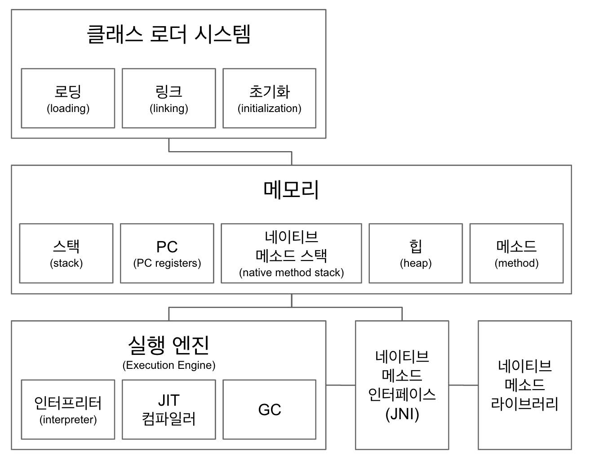

## JVM 구조

### JVM 이란
- 자바 가상 머신으로 자바 바이트 코드(.class)를 OS 에 특화된 코드로 변환(인터프리터와 JIT 컴파일러) 하여 실행한다.
- 바이트 코드를 실행하는 표준(JVM 자체는 표준)이자 구현체(특정 밴더가 구현한 JVM)
- JVM 밴더 : 오라클, 아마존, AZUL
- 특정 플랫폼에 종속적

### JVM 구조
<!--  -->

- 클래스 로더 시스템
    - .class 에서 바이트코드를 읽고 메모리에 저장
    - 로딩 : 클래스 읽어오는 과정
    - 링크 : 레퍼런스를 연결하는 과정
    - 초기화 : static 값들 초기화 및 변수에 할당

- 메모리(run time data area)
    - 메소드 영역에서는 클래스 수준의 정보 (클래스 이름[패키지 포함], 부모 클래스 이름, 메소드, 변수 [static 포함]) 저장. 공유 자원
    - 힙 영역에는 객체를 저장한다. 공유자원
    - 스택 
        - 쓰레드 마다 런타임 스택을 만들고, 그 안에 메소드 호출을 스택 프레임이라 부르는 블럭으로 쌓는다. 쓰레드가 종료하면 런타임 스택도 사라진다.
        - 스택은 쓰레드 별로 1개만 존재하고, 스택 프레임은 메서드가 호출될 때마다 생성된다. 메서드 실행이 끝나면 스택 프레임은 pop 되어 스택에서 제거된다.
        - 스택 프레임에는 local variables array, 현재 메소드가 속한 클래스/객체에 대한 참조 정보(인스턴스 주소값)
    - PC(program register)
        - 쓰레드 마다 쓰레드 내 현재 실행할 스택 프레임을 가리키는 포인터가 생성된다.
        - 각 쓰레드는 메서드를 실행하고 있고, PC는 그 메서드 내에서 몇 번째 줄을 실행해야 하는지 나타내는 역할을 한다.
    - native method stack
        - 자바 바이트코드가 아닌 다른 언어로 작성된 메서드 영역(C, C++)

- 실행 엔진(execution engine)
    - 인터프리터 : 바이트 코드를 한 줄씩 실행
    - JIT 컴파일러 
        - 인터프리터 효율을 높이기 위해, 인터프리터가 반복되는 코드를 발견하면 JIT 컴파일러로 반복되는 코드를 모두 네이티브 코드로 바꿔준다. 그 다음부터 인터프리터는 네이티브 코드로 컴파일된 코드를 바로 사용한다.
    - GC
        - 더이상 참조되지 않는 객체를 모아서 정리
        - throughput 위주의 GC 
        - stop the world 를 줄이는 GC
            - 서버 운영중에 많은 객체를 생성하고 response time이 중요한 경우 사용
            - GC 를 할 때 발생하는 멈춤 현상을 줄이기 위해 사용 

1. 클래스 로더가 읽어서 메모리에 배치
    - 힙이랑 메소드 영역에 적절히 배치
2. 실행엔진이 한 줄 씩 바이트코드를 컴파일을 하면서 중복되는 코드는 JIT 컴파일러를 이용해서 네이티브 코드로 변환해준다. 인터프리터는 중복된 코드를 발견하면 이 네이티브 코드를 바로 사용한다.  

## 함수형 프로그래밍
> 하나의 프로그램을 수학에서의 함수의 합성체로 보는 관점

## 프로세스 / 쓰레드

- 프로세스
    - 실행중인 프로그램(실행되기 전 상태의 명령어. 코드 및 정적인 데이터의 묶음)
    - 운영체제로부터 시스템 자원을 할당 받는 작업의 단위
    - 구조
        - stack : 매개변수, 지역변수 등 임시적인 자료
        - heap : 동적으로 할당되는 메모리
        - data : 전역 변수
        - text : 프로그램의 코드
    - PCB
        - 각 프로세스는 운영체제에서 PCB 로 표현
        - PID : 프로세스 식별자
        - 상태 : new, ready, running, waiting, halted
        - 프로그램 카운터 : 다음 실행할 명령어의 주소
        - 스케줄링 정보 : 우선순위 등

- 쓰레드
    - 프로세스 내에서 실행되는 흐름의 단위
    - CPU 이용의 기본단위
    - 프로세스의 text, heap, data 영역을 공유
    - 각 쓰레드는 별도의 stack 영역을 가짐

- 멀티 쓰레드
    - 프로세스의 자원을 공유
    - 향상된 응답성 
    - context switching 비용이 적음
    - 자원을 공유하는 만큼 충돌 주의 (thread-safe 하게)
    - ex. web server

- 멀티 프로세스
    - 하나의 작업을 여러 개의 프로세스가 처리
    - 프로세스간 통신 (IPC)
    - context switching 비용이 큼
    - 자식 프로세스 중 하나가 문제 생겨도 다른 프로세스에 영향이 없음
    - ex. google chrome

## index
> 색인을 위해 임의의 규칙대로 부여된 임의의 대상을 가리키는 무언가

- clustered index
    - 군집화된 인덱스
    - 인덱스와 데이터가 군집
    - 인덱스와 데이터가 밀접하게 관계를 맺고 있다. (PK 와 유사)
    - 순서대로 테이블 당 하나씩만 존재
    - 범위 검색 시 좋음
    - 존재하는 PK 사이에 insert 할 경우 성능 이슈
- non-clustered index
    - 데이터와 연결되어있지 않고 인덱스와 연결되어있다. (간접참조)
    - 순서와 상관없고 데이터를 가지지 않는다.
    - 한 테이블 당 여러개 가질 수 있음
    - 추가 저장 공간 필요 (약 10% 정도)
    - insert 시 추가 작업 필요 (인덱스 생성)
    - 카디널러티가 높은걸 골라야 함

## 서블릿 / 스프링

### 서블릿
> HTML 등의 웹 콘텐츠를 생성하고 전달하기 위해 Servlet 클래스의 구현 규칙을 지켜 자바로 만들어진 프로그램

- 서블릿 컨테이너가 서블릿 인터페이스를 상속받아 구현된 서블릿들을 가지며 서버와 통신
- 웹 서버 내부에서 동작하는 작은 자바 프로그램
- 서블릿도 CGI 규약에 따라 데이터를 주고받지만 이를 서블릿을 가지고 있는 컨테이너에게 위임하고 대신 서블릿 컨테이너와 서블릿 사이의 규칙이 존재
- 서블릿 컨테이너 내부에서 쓰레드 단위로 컨테이너가 요청을 처리하고 서블릿 인스턴스의 생명주기는 서블릿 컨테이너가 관리한다.

- CGI(Common Gateway Interface) : http 통신규약을 사용하는 웹서버가 웹 어플리케이션(동적 웹페이지 생성 목적)과 데이터를 주고 받는 규약
    - 인터페이스 이므로 여러 언어로 구현 가능
    - 서블릿 이전에는 직접 구현

### 스프링
> 자바 엔터프라이즈 개발을 편리하게 해주는 오픈소스 경량급 애플리케이션 프레임워크

### AOP
> OOP를 보완하는 수단으로, 흩어진 Aspect를 모듈화 할 수 있는 프로그래밍 기법

- 흩어진 관심사 (crosscutting concerns)
    - 여러 클래스에 흩어진 비슷한 코드
    - 이 관심사가 변경이 되면 적용된 클래스 마다 다 수정해야 함
    - Aspect 를 이용하여 이 문제를 해결

- Aspect
    - 흩어져있는 관심사를 모아 모듈화 한 것
    - 어느 클래스에 관심사를 적용할지 정할 수 있다.

### AOP 적용방법
- 컴파일
    - 자바 파일을 클래스 파일로 변환할 때 이미 AOP가 적용된 바이트코드를 만들어내는 방법
    - 로드타임, 런 타임때 성능적인 부하가 없다. 대신 별도의 컴파일을 한 번 더 해야한다.
- 로드 타임
    - 타겟 클래스는 순수한 상태로 컴파일되고 타겟 클래스가 로딩 될때 위빙으로 (로드 타임 위빙) Aspect 를 끼워넣는다.
    - 클래스 로딩 시점에 약간의 부하가 생길 수 있다.
    - 로드 타임 위버를 설정해야 한다.
    - 다양한 문법 사용 가능 (AspectJ 사용가능)
- 런 타임
    - 타겟 클래스로 빈을 만들 때 우선 타겟 클래스의 프록시 빈을 만든다. 프록시 빈이 타겟 클래스의 특정 메소드를 호출 하기 직전 Aspect 를 실행하고 특정 메소드를 호출한다.
    - 스프링에서 하는 방법
    - 최초에 빈을 생성할 때 비용 발생

### 주요 개념
- Advice : 해야할 일
- pointcut : 적용될 대상
- Join point : 합류점??
    - 어느 시점에 해당 advice를 끼워넣을지 지정
    - 메소드 호출 시점, 생성자 호출 전, 필드 접근 전, 접근 후 등등

### AOP 구현체
- AspectJ
    - AOP 와 관련된 다양한 기능을 제공
- 스프링 AOP
    - 국한적인 기능만 제공
        - 스프링 IoC와 연동하여 엔터프라이즈 애플리케이션의 가장 흔한 기능만 제공하는 것이 목적
    - 프록시 기반의 AOP
    - 스프링 빈에만 AOP를 적용할 수 있다